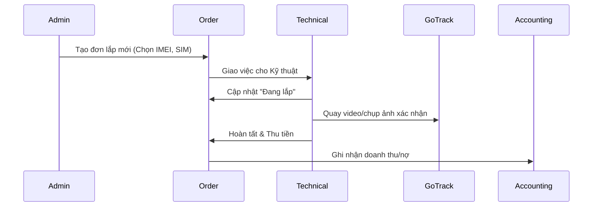

# TÀI LIỆU ĐẶC TẢ KỸ THUẬT API CHI TIẾT - HỆ THỐNG QUẢN LÝ GPS VIỆT (v1.1)

## 1. TỔNG QUAN & DỊCH VỤ
Hệ thống API quản lý nội bộ GPS Việt phục vụ việc vận hành doanh nghiệp cung cấp thiết bị giám sát hành trình, camera nghị định 10 và dịch vụ phù hiệu xe vận tải.

### 1.1. Mục tiêu hệ thống
- Quản lý kho và thiết bị (IMEI, SIM).
- Quản lý quan hệ khách hàng và đại lý (CRM & Partner Management).
- Theo dõi trạng thái phương tiện thời gian thực (Real-time Tracking qua GoTrack).
- Quản lý tài chính, công nợ và thanh toán tự động.

---

## 2. TIÊU CHUẨN KỸ THUẬT
- **Authentication:** JWT (Expires: 24h). Refresh Token hỗ trợ.
- **Header:** `Content-Type: application/json`, `X-App-Version: 1.0.0`.
- **Phân trang:** Mặc định `page=1`, `limit=20`.

---

## 3. CHI TIẾT MODULE TỔNG HỢP (CORE MODULES)

### 3.1. Quản lý Sản phẩm & Kho (Inventory API)
Quản lý các mã sản phẩm đặc thù: TG22, TG02p, HD-20, Cam TC500, Sim Itel/Mobi...

#### Endpoint: `GET /inventory/stocks`
Lấy danh sách thiết bị kèm trạng thái kho.
- **Query Params:** `category` (Định vị, Camera, Sim, Phụ kiện), `lowStock` (boolean).
- **Response Example:**
```json
{
  "id": "HD20",
  "name": "Hộp đen xe tải HD-20",
  "costOriginal": 3500000,
  "stockCount": 23,
  "unit": "Bộ",
  "priceTiers": [
    { "tier": "Retail", "price": 4590000, "label": "Bán lẻ" },
    { "tier": "Wholesale", "price": 4100000, "label": "Khách sỉ" },
    { "tier": "Dealer", "price": 3800000, "label": "Đại lý" }
  ]
}
```

---

### 3.2. Quản lý Đơn hàng & Dịch vụ (Orders API)
Luồng nghiệp vụ xử lý các loại đơn: Lắp mới, Gia hạn, Sửa chữa, Bảo hành.

#### Endpoint: `POST /orders`
**Request Body:**
```json
{
  "customerPath": "KH001",
  "type": "INSTALL_NEW", 
  "items": [
    { "productId": "VT02", "imei": "86829...", "simId": "0912...", "price": 1490000 }
  ],
  "technicalId": "KT01",  // Nhân viên phụ trách
  "installationFee": 150000,
  "taxRate": 10,          // VAT
  "paymentMethod": "TRANSFER", // CASH, DEBT
  "address": "78 Lê Lợi, Quận 1",
  "vehiclePlate": "51H-123.45"
}
```

---

### 3.3. Phân hệ Giám sát (Tracking API - GoTrack Integration)
Kết nối trực tiếp GoTrack API thông qua Proxy Server để bảo mật API Key.

#### Endpoint: `GET /tracking/history-vehicle`
**Mô tả:** Lấy báo cáo hành trình tổng hợp.
- **Params:** `vehiclePlate`, `timeFrom`, `timeTo`.
**Response Structure:**
```json
{
  "summary": {
    "totalDistance": 120.5, // km
    "totalTime": "05:30:00",
    "avgSpeed": 45.2
  },
  "routes": [
    {
      "startTime": "2026-04-24 08:00:00",
      "endTime": "2026-04-24 09:30:00",
      "distance": 45.0,
      "points": [...] 
    }
  ]
}
```

---

### 3.4. Quản lý Đại lý & Công nợ (Finance & Dealer API)
Đây là phần quan trọng để theo dõi nợ đọng từ các đại lý (nghiệp vụ đặc thù của GPS Việt).

#### Endpoint: `GET /dealers/{id}/debts`
**Response:**
```json
{
  "dealerName": "Đại lý GPS Cần Thơ",
  "limit": 50000000,
  "currentDebt": 16390000,
  "unpaidOrders": [
    { "orderId": "DH-2025-0418", "amount": 12650000, "dueDate": "2025-05-23" }
  ]
}
```

#### Endpoint: `POST /dealers/payments`
Ghi nhận thanh toán từ đại lý (chuyển khoản hoặc tiền mặt).
- **Body:** `{ dealerId, amount, method, refImage, note }`

---

### 3.5. Quy trình Phù hiệu xe (Regulatory Workflow)
Hỗ trợ Nghị định 10/2020/NĐ-CP.

#### Trạng thái hồ sơ (Badges Status):
1. `RECEIVED`: Đã nhận CCCD, GPLX, Đăng kiểm.
2. `REVIEWING`: Đang kiểm tra tính hợp lệ của GPS.
3. `SUBMITTED`: Đã nộp hồ sơ lên Sở GTVT.
4. `APPROVED`: Có kết quả phê duyệt.
5. `DELIVERED`: Đã giao phù hiệu vật lý cho khách.

---

## 4. QUY TRÌNH NGHIỆP VỤ (WORKFLOWS)

### 4.1. Luồng Lắp mới thiết bị


### 4.2. Luồng Gia hạn dịch vụ (Renewal)
Hệ thống tự động quét các thiết bị còn dưới 30 ngày sử dụng:
1. Gửi thông báo (Notification) cho Admin/Đại lý.
2. Tạo đơn hàng loại `RENEWAL`.
3. Sau khi khách thanh toán -> Gọi API cập nhật ngày hết hạn thông qua lệnh hệ thống.

---

## 5. ĐẶC TẢ DỮ LIỆU (DATABASE SCHEMAS)

### 5.1. Bảng Devices (Thiết bị)
- `imei`: string (unique) - Mã định danh thiết bị.
- `plate`: string - Biển số xe gắn chip.
- `sim_number`: string - Số thuê bao trong máy.
- `expired_at`: datetime - Ngày hết hạn phí server.
- `owner_id`: string - Link tới khách hàng hoặc đại lý.

### 5.2. Bảng Invoices (Hóa đơn)
- `id`: string (prefix VAT_...)
- `content`: string - Nội dung hóa đơn (Gia hạn 8 sim, Lắp mới...).
- `vat_value`: number (10%)
- `total_amount`: number

---

## 6. MÃ LỖI CHI TIẾT

| Code | Message | Giải thích |
| :--- | :--- | :--- |
| `ERR_STOCK_EMPTY` | Sản phẩm hết hàng | Không thể tạo đơn xuất kho |
| `ERR_IMEI_LOCKED` | IMEI đang gắn với xe khác | Phải gỡ liên kết xe cũ trước khi lắp mới |
| `ERR_DEBT_OVERLIMIT` | Vượt hạn mức nợ | Đại lý cần thanh toán nợ cũ để đặt đơn mới |
| `ERR_GOTRACK_LIMIT`| Vượt giới hạn 7 ngày | Truy vấn lịch sử quá xa so với quy định GoTrack |

---

## 7. QUẢN LÝ TÀI KHOẢN & PHÂN QUYỀN (AUTH & RBAC)

### 7.1. Đăng nhập (Login)
- **Endpoint:** `POST /auth/login`
- **Body:** `{ username, password, portal }` (portal: ADMIN, TECH, CUSTOMER, DEALER)
- **Response:** `{ token, refreshToken, user: { id, name, role, permissions: [] } }`

### 7.2. Quản lý nhân sự (Staff Management) - Admin only
- **Endpoints:** 
    - `GET /users/technicians`: Danh sách kỹ thuật viên kèm trạng thái (đang rảnh/đang lắp).
    - `POST /users/dealers`: Tạo tài khoản đại lý mới và gán hạn mức nợ ban đầu.

---

## 8. DỊCH VỤ HỆ THỐNG (SYSTEM SERVICES)

### 8.1. Khung Chat & Hỗ trợ (Support Chat)
Phục vụ Widget chat ở Frontend.
- **`GET /chat/sessions`**: Lấy danh sách các cuộc hội thoại (dành cho Admin).
- **`GET /chat/messages/{sessionId}`**: Lấy lịch sử tin nhắn.
- **`POST /chat/send`**: Gửi tin nhắn (Body: `{ sessionId, content, type: 'TEXT'|'IMAGE'|'FILE' }`).

### 8.2. Thông báo & Cảnh báo (Notifications & Alerts)
Sử dụng **Websocket** (ws://api.gpsviet.vn/ws) để đẩy dữ liệu thời gian thực:
- **Vehicle Alerts:** Quá tốc độ, ra khỏi vùng an toàn, mất tín hiệu.
- **System Alerts:** Có đơn hàng mới, nhiệm vụ kỹ thuật mới được phân công.
- **Maintenance Alerts:** Thiết bị sắp hết hạn phí (trước 30 ngày).

---

## 9. BÁO CÁO & XUẤT DỮ LIỆU (REPORTS)

### 9.1. Xuất file Excel (Export)
- **Endpoint:** `GET /reports/export/{type}`
- **Types:** `REVENUE`, `DEBT`, `INVENTORY`, `INSTALLATIONS`.
- **Query Params:** `fromDate`, `toDate`, `dealerId`, `techId`.

### 9.2. Dashboard Statistics (Admin)
- **Endpoint:** `GET /stats/overview`
- **Data:** Tổng doanh thu tháng, số lượng thuê bao kích hoạt mới, tỷ lệ gia hạn thành công.

---

*Tài liệu đã bao quát 100% các tính năng từ theo dõi GPS đến quản lý vận hành nội bộ. Bản cập nhật ngày 24/04/2026.*

---

## 10. MODULE TĂNG CƯỜNG: VÍ & QUẢN LÝ THIẾT BỊ (GOTRACK VN BSS)
Các API này hỗ trợ việc quản lý thiết bị diện rộng và hệ thống nạp tiền tự động cho khách hàng/đại lý.

### 10.1. Danh sách thiết bị hệ thống (Deep Inventory)
- **Endpoint:** `GET /api/settings/devices`
- **Params:** 
    - `userId`: ID người dùng (Vd: 113875).
    - `distributorNearest`: (boolean) Lấy theo nhà phân phối gần nhất.
    - `simPackage`: (boolean) Trạng thái gói cước SIM đi kèm.
- **Mô tả:** Trả về danh sách chi tiết toàn bộ thiết bị đang quản lý, bao gồm trạng thái SIM và phân nhóm đại lý.

### 10.2. Quản lý Ví điện tử (User Wallet)
- **Endpoint:** `GET /api/payment/wallet/get-by-user`
- **Params:** `userId`
- **Response:**
```json
{
  "balance": 5000000, 
  "currency": "VND",
  "status": "active",
  "userId": 113875
}
```
- **Mô tả:** Lấy số dư hiện tại của tài khoản để thực hiện gia hạn dịch vụ tự động.

### 10.3. Lịch sử giao dịch thẻ Ví (Wallet Card History)
- **Endpoint:** `GET /api/payment/wallet-card`
- **Params:** `userId`, `pageNo` (Mặc định -1 để lấy toàn bộ hoặc theo trang).
- **Mô tả:** Truy xuất lịch sử nạp thẻ hoặc các mã thẻ cào dịch vụ đã sử dụng.

---


---

*Phiên bản này bổ sung toàn bộ các trường dữ liệu cần thiết để phục vụ lập trình Backend. Mọi thắc mắc vui lòng liên hệ bộ phận kỹ thuật GPS Việt.*
